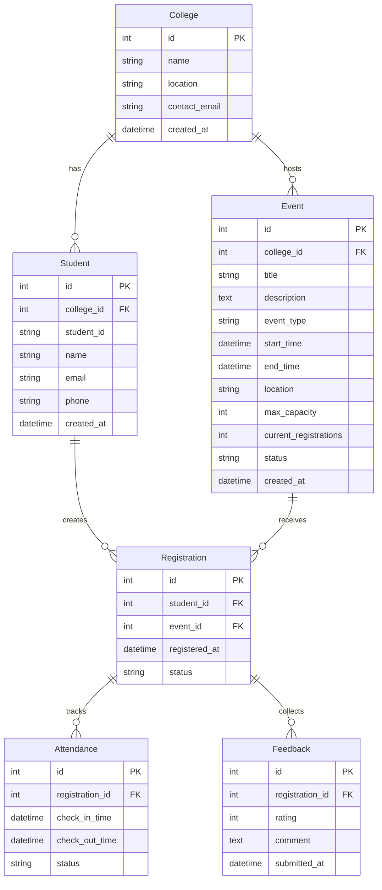
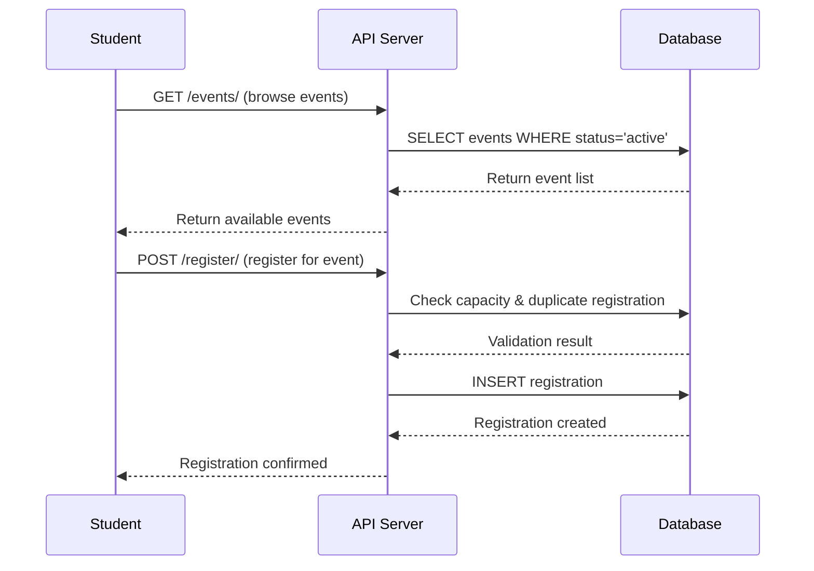
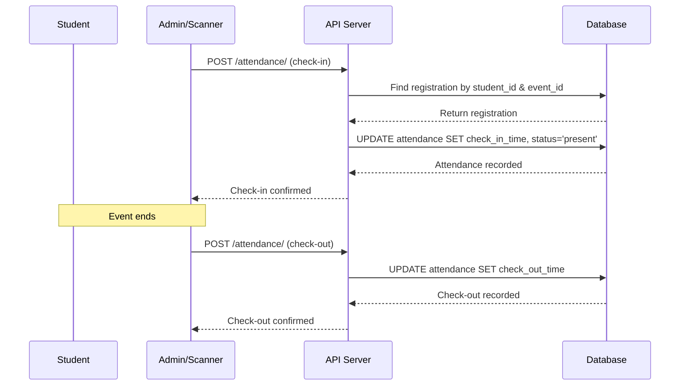
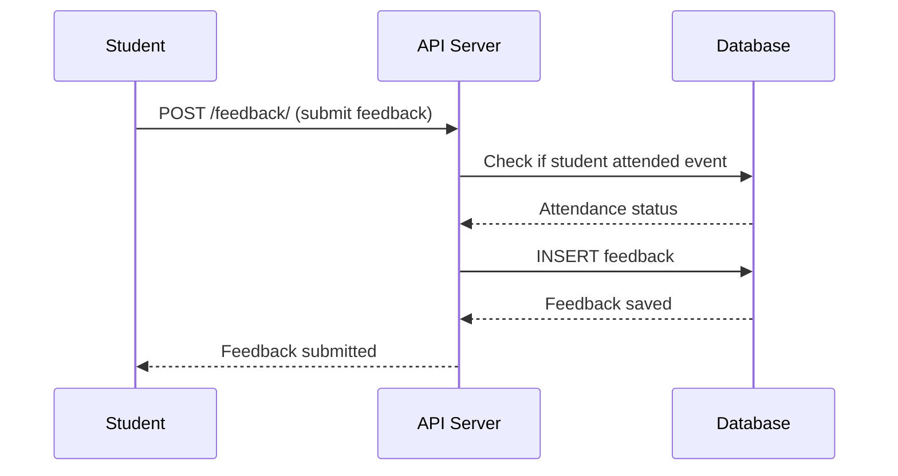

# Campus Event Management Platform – Design Document

## System Overview

The Campus Event Management Platform is a simplified event reporting system designed to manage campus events across multiple colleges. The system supports two primary user roles:

- **Admin Portal (Web)**: Staff members create, manage, and monitor events
- **Student App (Mobile/Web)**: Students browse events, register, check-in, and provide feedback

### Scale Assumptions
- ~50 colleges
- ~500 students per college
- ~20 events per semester per college
- Total capacity: ~25,000 students, ~1,000 events per semester

## Data to Track

### Core Entities
1. **Event Creation**: Event details, timing, capacity, type, college association
2. **Student Registration**: Student enrollment in events with timestamps
3. **Attendance Tracking**: Check-in/check-out times, attendance status
4. **Feedback Collection**: Student ratings and comments for events
5. **Reporting Data**: Aggregated statistics for analytics and insights

## Database Schema

### Entity Relationship Diagram



### Table Structures

#### College
```sql
CREATE TABLE colleges (
    id INTEGER PRIMARY KEY AUTOINCREMENT,
    name VARCHAR(255) NOT NULL,
    location VARCHAR(255),
    contact_email VARCHAR(255),
    created_at TIMESTAMP DEFAULT CURRENT_TIMESTAMP
);
```

#### Student
```sql
CREATE TABLE students (
    id INTEGER PRIMARY KEY AUTOINCREMENT,
    college_id INTEGER NOT NULL,
    student_id VARCHAR(50) NOT NULL,
    name VARCHAR(255) NOT NULL,
    email VARCHAR(255) NOT NULL,
    phone VARCHAR(20),
    created_at TIMESTAMP DEFAULT CURRENT_TIMESTAMP,
    FOREIGN KEY (college_id) REFERENCES colleges(id) ON DELETE CASCADE,
    UNIQUE(college_id, student_id)
);
```

#### Event
```sql
CREATE TABLE events (
    id INTEGER PRIMARY KEY AUTOINCREMENT,
    college_id INTEGER NOT NULL,
    title VARCHAR(255) NOT NULL,
    description TEXT,
    event_type VARCHAR(100) NOT NULL,
    start_time TIMESTAMP NOT NULL,
    end_time TIMESTAMP NOT NULL,
    location VARCHAR(255),
    max_capacity INTEGER DEFAULT 100,
    current_registrations INTEGER DEFAULT 0,
    status VARCHAR(20) DEFAULT 'active',
    created_at TIMESTAMP DEFAULT CURRENT_TIMESTAMP,
    FOREIGN KEY (college_id) REFERENCES colleges(id) ON DELETE CASCADE
);
```

#### Registration
```sql
CREATE TABLE registrations (
    id INTEGER PRIMARY KEY AUTOINCREMENT,
    student_id INTEGER NOT NULL,
    event_id INTEGER NOT NULL,
    registered_at TIMESTAMP DEFAULT CURRENT_TIMESTAMP,
    status VARCHAR(20) DEFAULT 'registered',
    FOREIGN KEY (student_id) REFERENCES students(id) ON DELETE CASCADE,
    FOREIGN KEY (event_id) REFERENCES events(id) ON DELETE CASCADE,
    UNIQUE(student_id, event_id)
);
```

#### Attendance
```sql
CREATE TABLE attendance (
    id INTEGER PRIMARY KEY AUTOINCREMENT,
    registration_id INTEGER NOT NULL,
    check_in_time TIMESTAMP,
    check_out_time TIMESTAMP,
    status VARCHAR(20) DEFAULT 'absent',
    FOREIGN KEY (registration_id) REFERENCES registrations(id) ON DELETE CASCADE
);
```

#### Feedback
```sql
CREATE TABLE feedback (
    id INTEGER PRIMARY KEY AUTOINCREMENT,
    registration_id INTEGER NOT NULL,
    rating INTEGER CHECK (rating >= 1 AND rating <= 5),
    comment TEXT,
    submitted_at TIMESTAMP DEFAULT CURRENT_TIMESTAMP,
    FOREIGN KEY (registration_id) REFERENCES registrations(id) ON DELETE CASCADE
);
```

## API Design

### REST Endpoints

#### Event Management
- `POST /events/` - Create new event
- `GET /events/` - List all events (with filters)
- `GET /events/{event_id}` - Get event details
- `PUT /events/{event_id}` - Update event
- `DELETE /events/{event_id}` - Cancel event

#### Student Management
- `POST /students/` - Add new student
- `GET /students/` - List students (with filters)
- `GET /students/{student_id}` - Get student details
- `PUT /students/{student_id}` - Update student

#### Registration Management
- `POST /register/` - Register student for event
- `GET /register/` - List registrations (with filters)
- `DELETE /register/{registration_id}` - Cancel registration

#### Attendance Management
- `POST /attendance/` - Mark attendance (check-in/check-out)
- `GET /attendance/` - List attendance records

#### Feedback Management
- `POST /feedback/` - Submit feedback
- `GET /feedback/` - List feedback (with filters)

#### Reporting Endpoints
- `GET /reports/registrations/` - Registration statistics per event
- `GET /reports/attendance/` - Attendance percentage per event
- `GET /reports/feedback/` - Average feedback score per event
- `GET /reports/top-students/` - Top 3 most active students
- `GET /reports/events/` - Event statistics with filters

## Workflows

### Student Registration Flow



### Attendance Tracking Flow



### Feedback Collection Flow



## Assumptions & Edge Cases

### Assumptions
1. **Unique Student IDs**: Student IDs are unique within each college, not globally
2. **Event Capacity**: Events have a maximum capacity limit
3. **Single Registration**: Students can only register once per event
4. **Attendance Window**: Check-in/check-out happens during event time
5. **Feedback Timing**: Feedback can be submitted after event completion
6. **Event Status**: Events can be 'active', 'cancelled', or 'completed'

### Edge Cases Handled
1. **Duplicate Registration**: Prevent multiple registrations for same event
2. **Capacity Overflow**: Reject registrations when event is full
3. **Missing Feedback**: Allow events without feedback (optional)
4. **Cancelled Events**: Handle event cancellations gracefully
5. **Invalid Attendance**: Prevent check-in for non-registered students
6. **Past Events**: Prevent registration for past events
7. **Concurrent Registrations**: Handle race conditions in registration

### Data Validation Rules
- Student email must be unique within college
- Event start_time must be before end_time
- Rating must be between 1-5
- Registration can only be created for active events
- Attendance can only be marked for registered students
- Feedback can only be submitted by attended students

### Performance Considerations
- Index on frequently queried fields (student_id, event_id, college_id)
- Pagination for large result sets
- Caching for frequently accessed data
- Batch operations for bulk data imports

