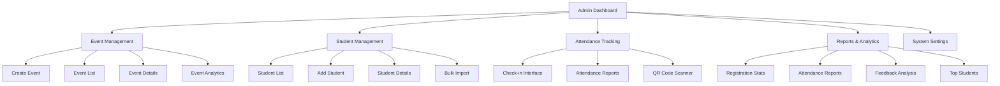
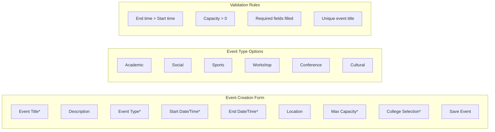
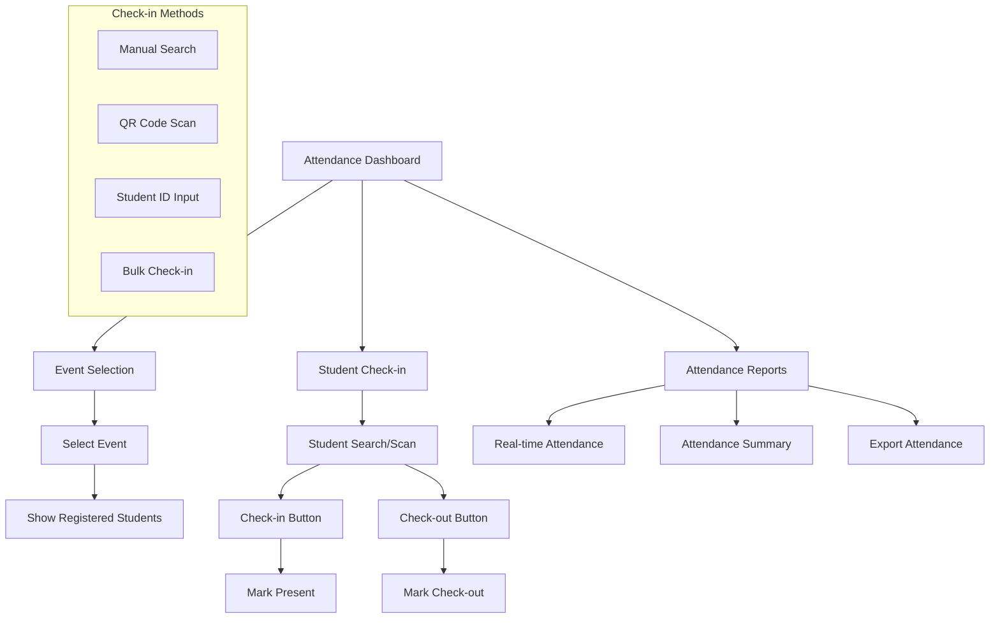
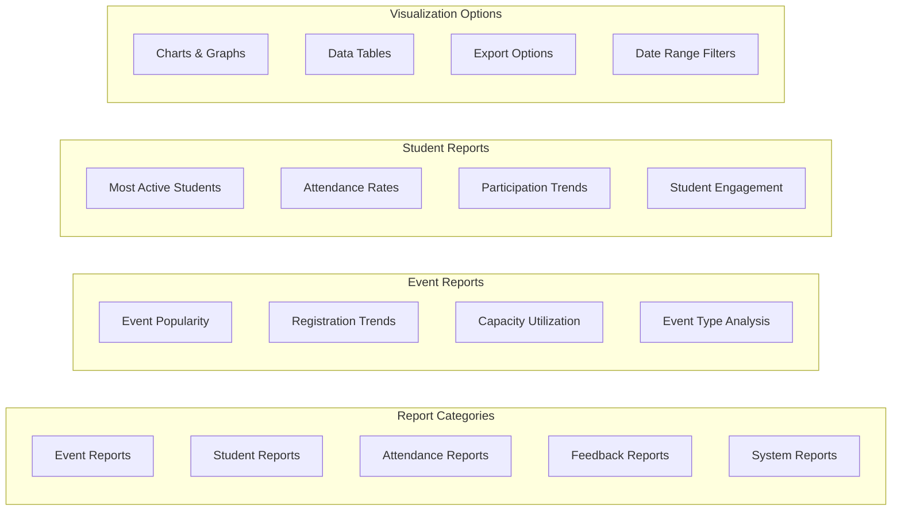
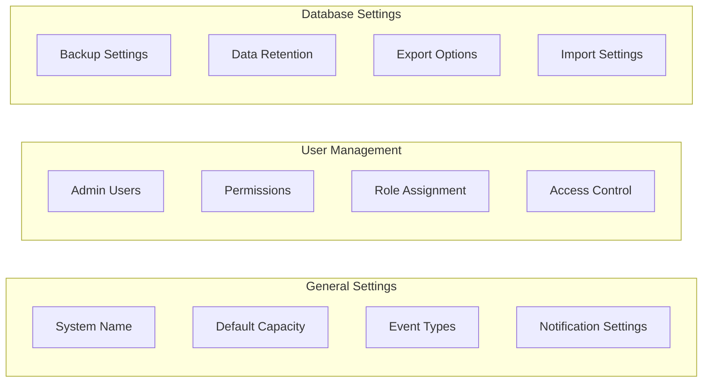

# Admin Portal Wireframes

## Admin Dashboard Overview



## Event Creation Interface



## Event Management Dashboard

```mermaid
graph TB
    subgraph "Event List Table"
        A[Event ID | Title | Type | Date | Capacity | Registrations | Status | Actions]
        B[001 | Tech Conference | Conference | 2024-03-15 | 200 | 150 | Active | Edit/View/Delete]
        C[002 | Sports Day | Sports | 2024-03-20 | 100 | 85 | Active | Edit/View/Delete]
        D[003 | Workshop | Workshop | 2024-03-10 | 50 | 50 | Completed | View/Reports]
    end
    
    subgraph "Filter Options"
        E[Filter by College]
        F[Filter by Event Type]
        G[Filter by Status]
        H[Filter by Date Range]
        I[Search by Title]
    end
    
    subgraph "Bulk Actions"
        J[Select All]
        K[Cancel Selected]
        L[Export to CSV]
        M[Send Notifications]
    end
```

## Attendance Tracking Interface



## Reports & Analytics Dashboard



## College Management Interface

```mermaid
graph TB
    subgraph "College List"
        A[College ID | Name | Location | Students | Events | Actions]
        B[001 | University A | New York | 500 | 25 | Edit/View/Stats]
        C[002 | College B | California | 300 | 15 | Edit/View/Stats]
    end
    
    subgraph "College Details"
        D[College Information]
        E[Student Management]
        F[Event Management]
        G[Performance Metrics]
    end
    
    subgraph "Bulk Operations"
        H[Import Students]
        I[Create Multiple Events]
        J[Send Notifications]
        K[Export Data]
    end
```

## System Settings Panel


