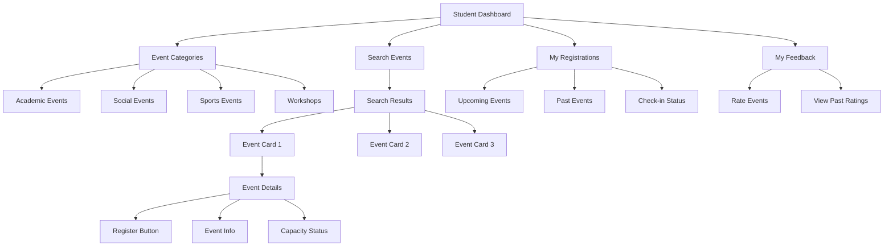
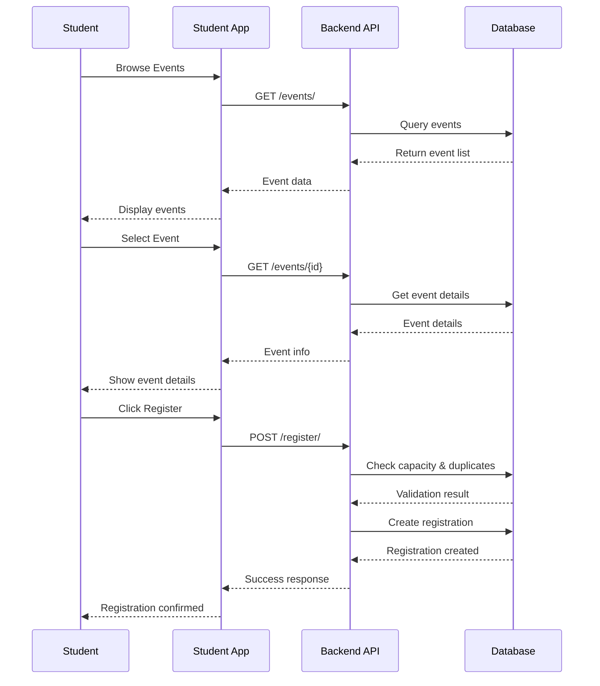
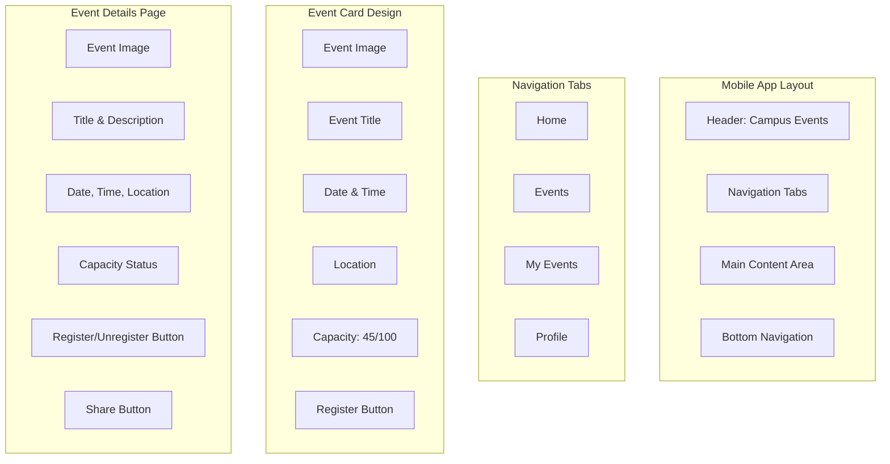
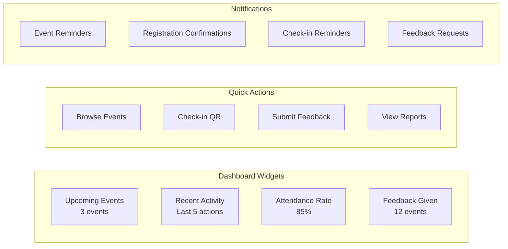

# Student App Wireframes

## Event Browsing Interface

```mermaid
graph TD
    A[Student Dashboard] --> B[Event Categories]
    A --> C[Search Events]
    A --> D[My Registrations]
    A --> E[My Feedback]
    
    B --> F[Academic Events]
    B --> G[Social Events]
    B --> H[Sports Events]
    B --> I[Workshops]
    
    C --> J[Search Results]
    J --> K[Event Card 1]
    J --> L[Event Card 2]
    J --> M[Event Card 3]
    
    K --> N[Event Details]
    N --> O[Register Button]
    N --> P[Event Info]
    N --> Q[Capacity Status]
    
    D --> R[Upcoming Events]
    D --> S[Past Events]
    D --> T[Check-in Status]
    
    E --> U[Rate Events]
    E --> V[View Past Ratings]
```

## Event Registration Flow

```mermaid
sequenceDiagram
    participant S as Student
    participant UI as Student App
    participant API as Backend API
    participant DB as Database
    
    S->>UI: Browse Events
    UI->>API: GET /events/
    API->>DB: Query events
    DB-->>API: Return event list
    API-->>UI: Event data
    UI-->>S: Display events
    
    S->>UI: Select Event
    UI->>API: GET /events/{id}
    API->>DB: Get event details
    DB-->>API: Event details
    API-->>UI: Event info
    UI-->>S: Show event details
    
    S->>UI: Click Register
    UI->>API: POST /register/
    API->>DB: Check capacity & duplicates
    DB-->>API: Validation result
    API->>DB: Create registration
    DB-->>API: Registration created
    API-->>UI: Success response
    UI-->>S: Registration confirmed
```

## Mobile App Layout

```mermaid
graph TB
    subgraph "Mobile App Layout"
        A[Header: Campus Events]
        B[Navigation Tabs]
        C[Main Content Area]
        D[Bottom Navigation]
    end
    
    subgraph "Navigation Tabs"
        E[Home]
        F[Events]
        G[My Events]
        H[Profile]
    end
    
    subgraph "Event Card Design"
        I[Event Image]
        J[Event Title]
        K[Date & Time]
        L[Location]
        M[Capacity: 45/100]
        N[Register Button]
    end
    
    subgraph "Event Details Page"
        O[Event Image]
        P[Title & Description]
        Q[Date, Time, Location]
        R[Capacity Status]
        S[Register/Unregister Button]
        T[Share Button]
    end
```

## Student Dashboard Components

```mermaid
graph LR
    subgraph "Dashboard Widgets"
        A[Upcoming Events<br/>3 events]
        B[Recent Activity<br/>Last 5 actions]
        C[Attendance Rate<br/>85%]
        D[Feedback Given<br/>12 events]
    end
    
    subgraph "Quick Actions"
        E[Browse Events]
        F[Check-in QR]
        G[Submit Feedback]
        H[View Reports]
    end
    
    subgraph "Notifications"
        I[Event Reminders]
        J[Registration Confirmations]
        K[Check-in Reminders]
        L[Feedback Requests]
    end
```
