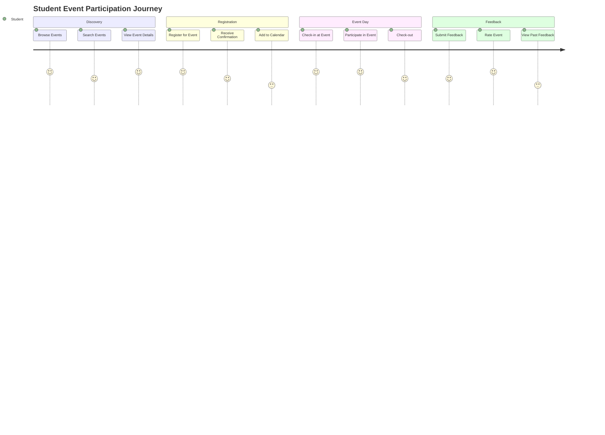
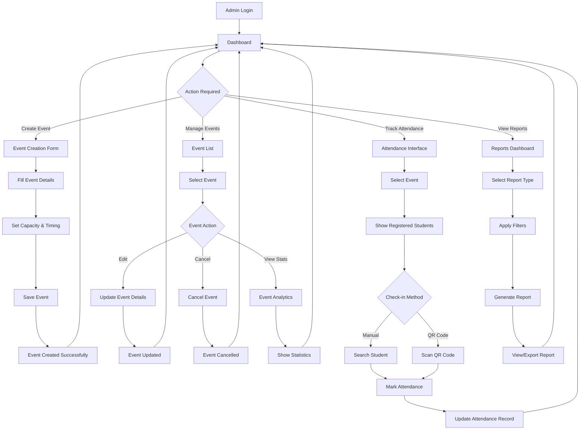
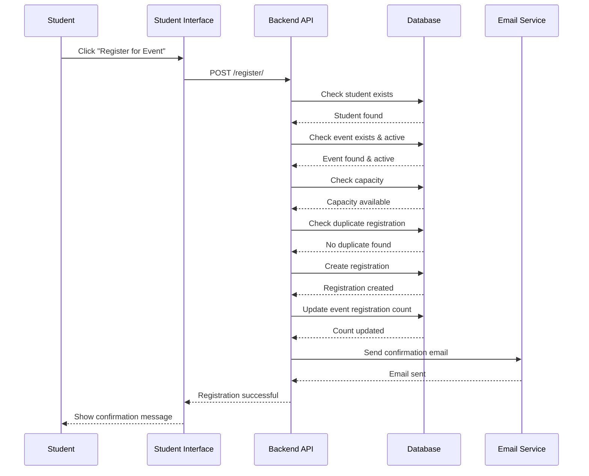
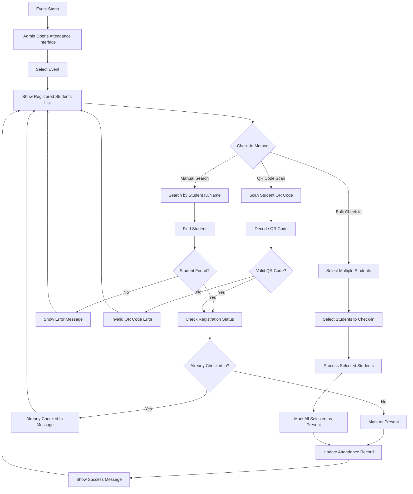
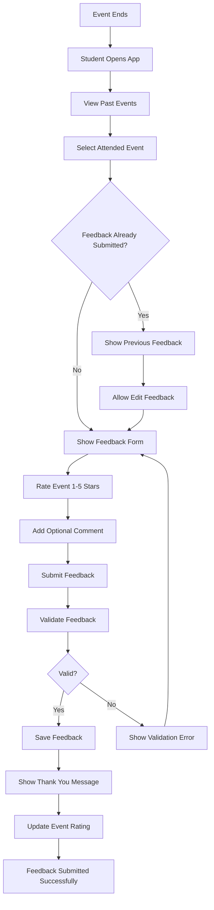
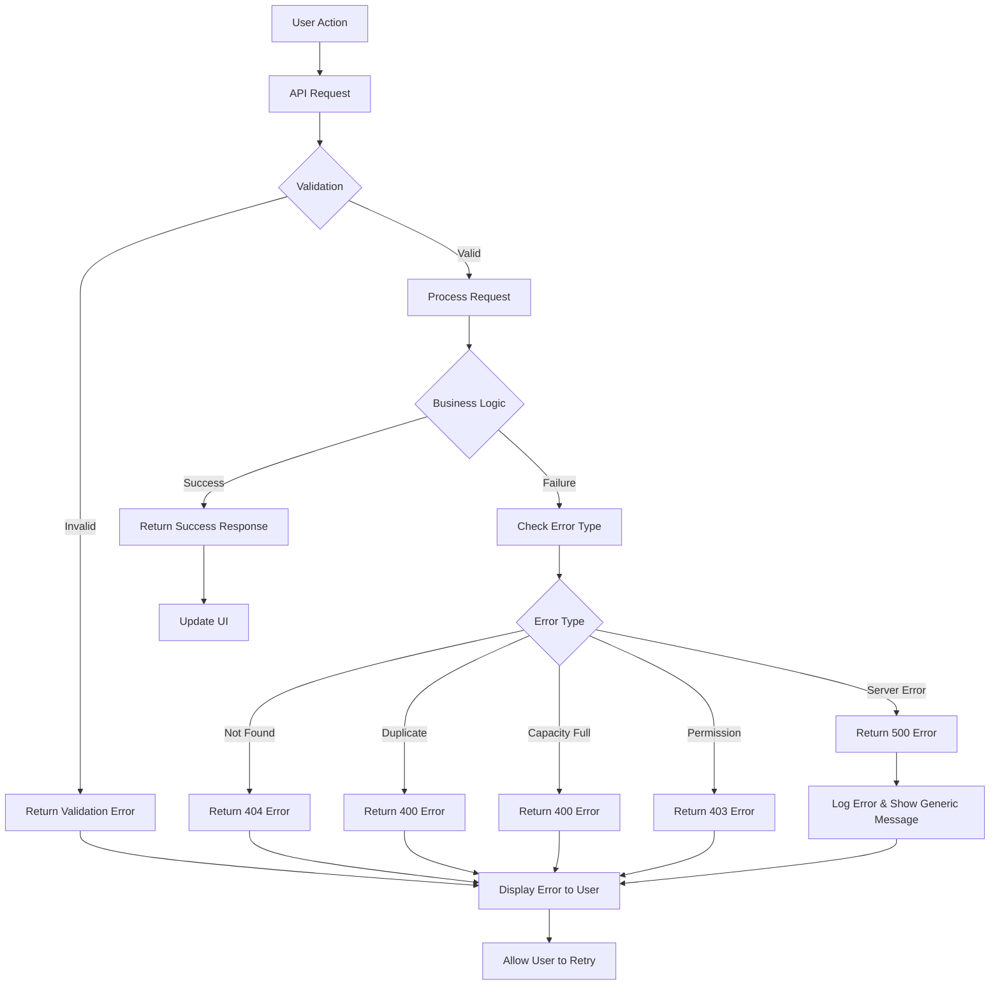
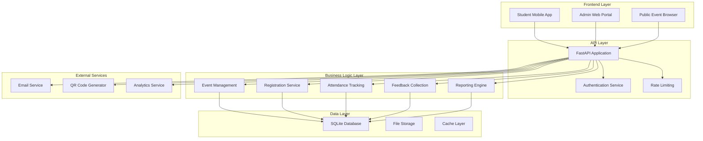

# User Flow Diagrams

## Complete Student Journey

## Admin Event Management Flow

## Registration Process Flow

## Attendance Tracking Flow

## Feedback Collection Flow

## Error Handling Flow

## System Architecture Flow

